

 

# B L E N D E R　创 作 记 录

初 一 → 初 二　·　场景创作与氛围练习

 

---

## 初一 ｜ 练习

 

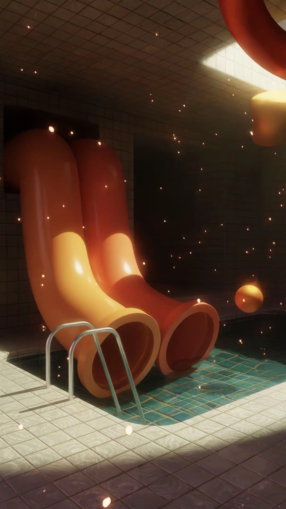

**室内水上乐园**

入门作品。跟随高小晟老师的教程搭建，并加入自己的创意

 

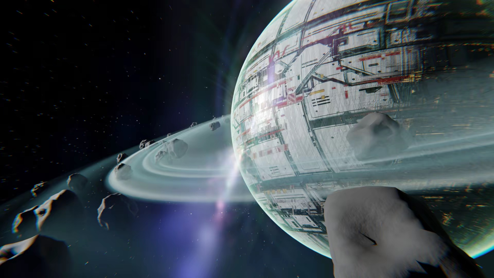

**环带行星**

行星场景创作。第一次组织环境、主体与镜头的关系

 

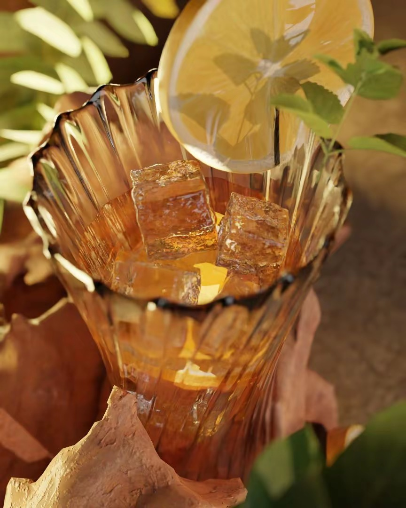

**柑橘冰饮静物**

第一次更专业地处理布光

 

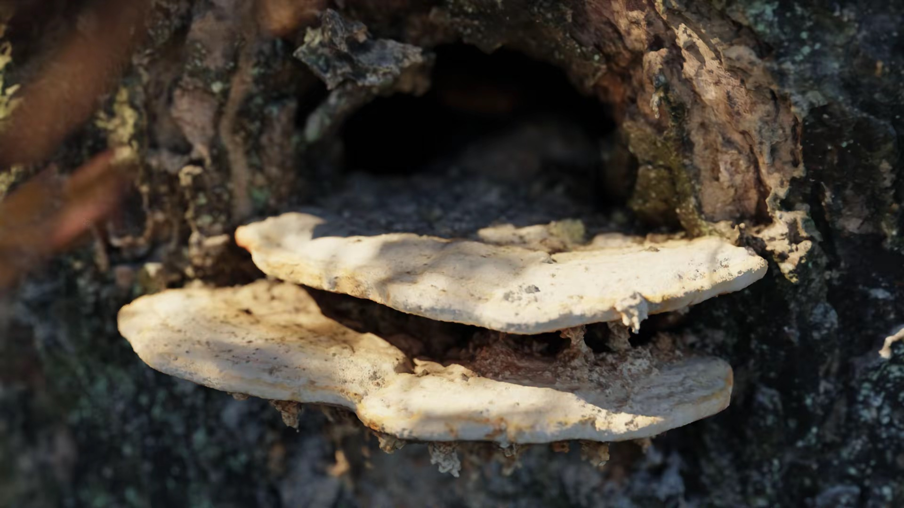

**树生菌微距**

用摄影测量重建老家树上的菌类，回到 Blender 补光、渲染

 

---

## 初二 ｜ 人物、环境与氛围

 

### 骸骨 · 制作页

植被散布学习

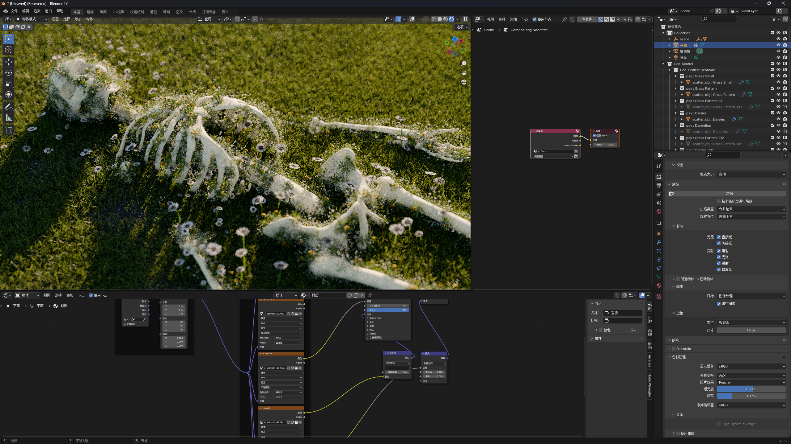

草地骸骨 · 制作界面

 

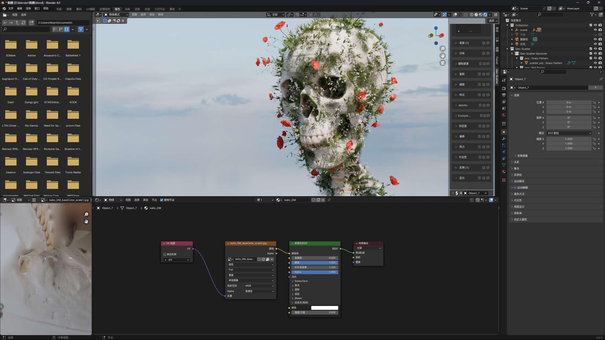

花植骷髅 · 制作界面

 

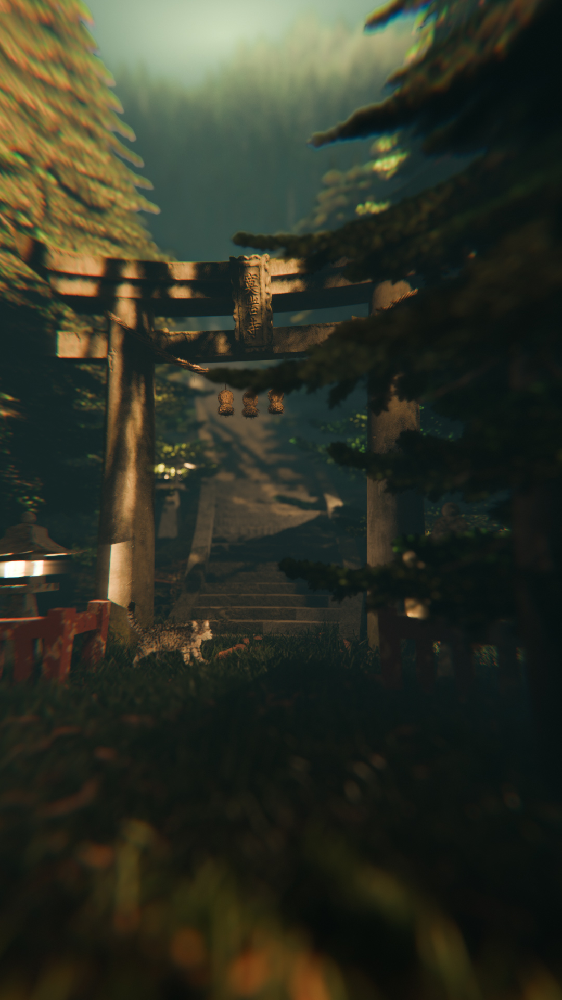

**雾中鸟居**　·　日式布景练习与环境雾的运用

 

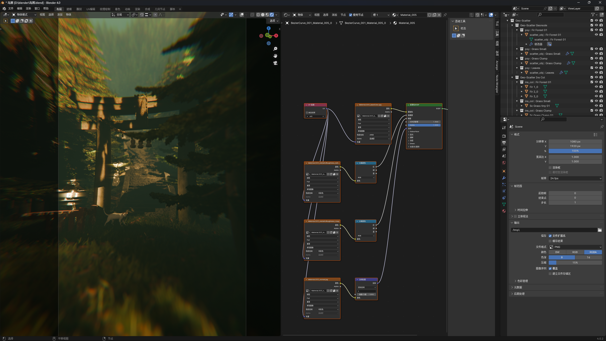

雾中鸟居 · 制作界面

 

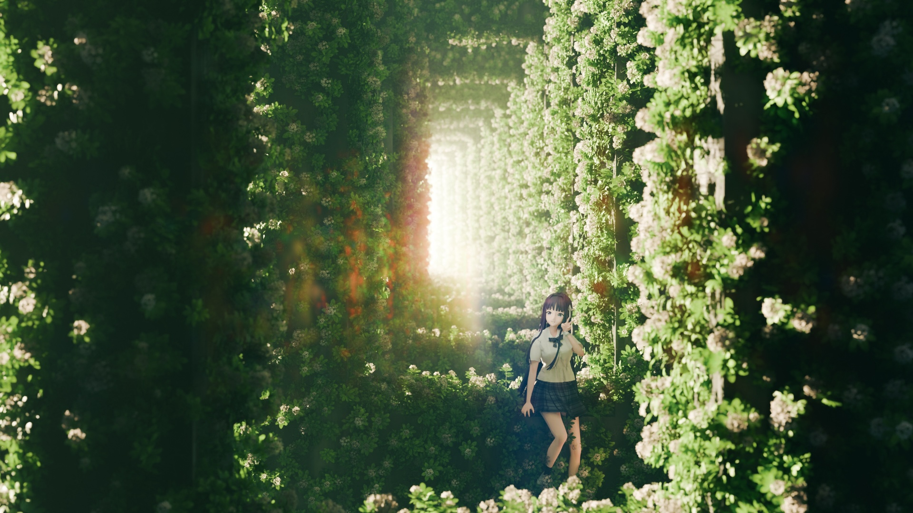

**花园少女**　·　人物场景练习-植被散布

 

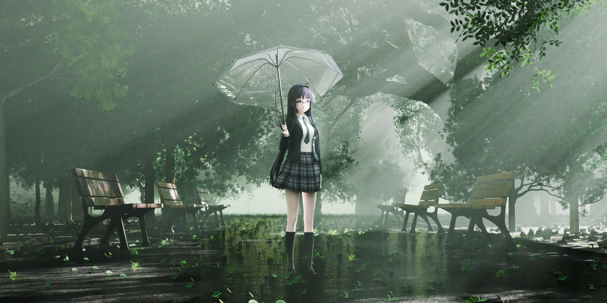

**雨中公园少女**　·　人物场景练习-粒子效果

 

---

## 校园走廊 ｜ 探索想法

完成于初二。从同一个基础场景出发，通过日式氛围、云海、黄昏、空间扭曲与爆炸等不同处理

发布在抖音后，获得了百万浏览和十万点赞

 

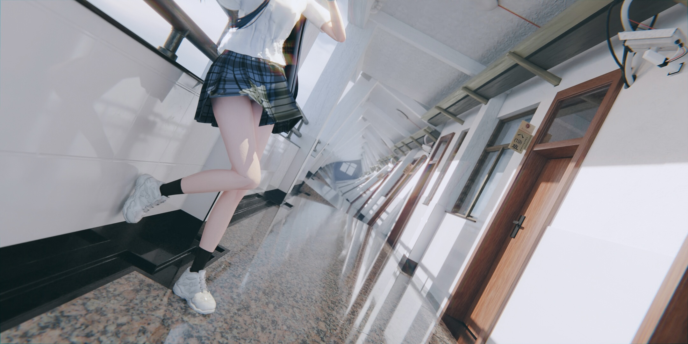

<b>日式人物版</b>　基础场景 · 人物

 

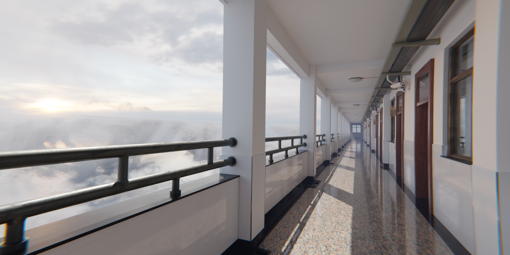

<b>云海晴天版</b>　云海 · 晴天

 

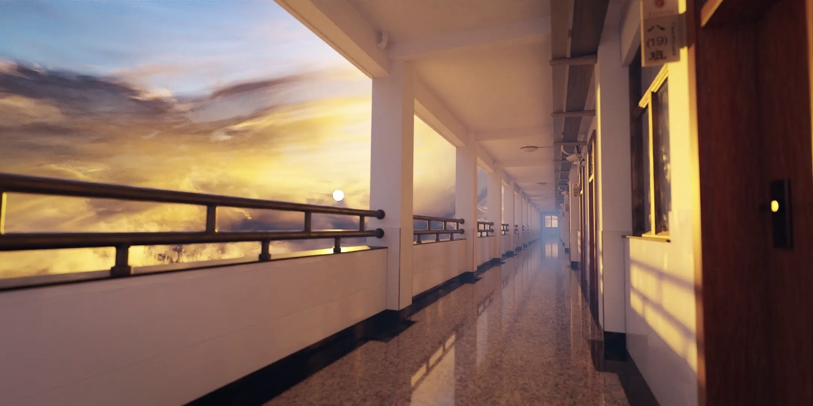

<b>云海黄昏版</b>　云海 · 黄昏氛围　·　<a href="./02_初二/06_校园走廊场景/视频/云海校园走廊_黄昏.MP4">播放视频 ▶</a>

 

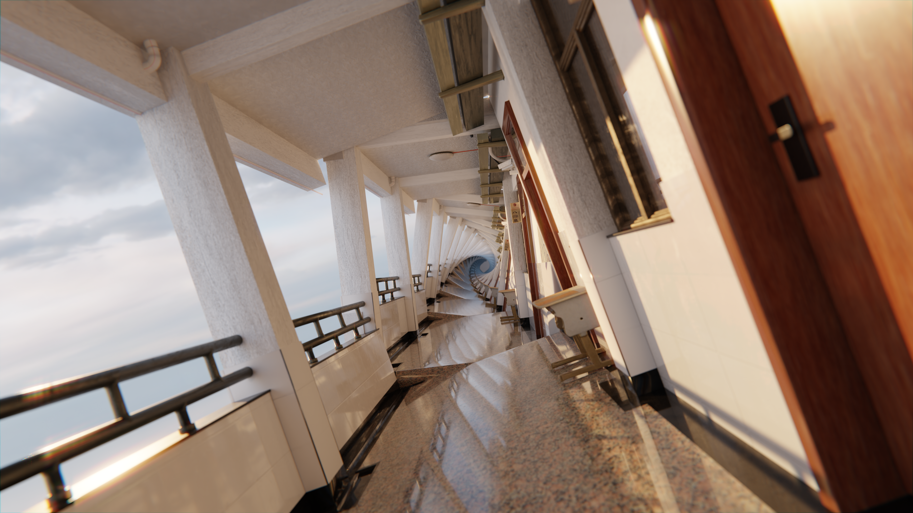

<b>空间扭曲版</b>　空间扭曲特效

 

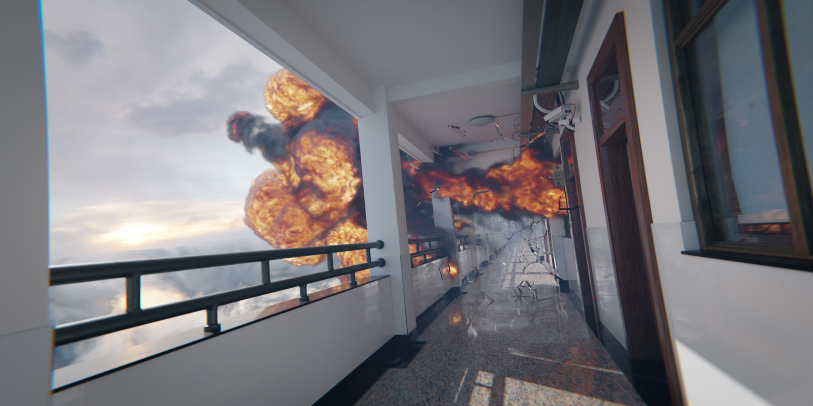

<b>爆炸版</b>　爆炸特效

 

<video src="./02_初二/06_校园走廊场景/视频/云海校园走廊_黄昏.MP4" controls muted loop playsinline width="100%" poster="./02_初二/06_校园走廊场景/成品/云海校园走廊_黄昏.JPEG"></video>

<b>黄昏动态版</b>　镜头动画

 

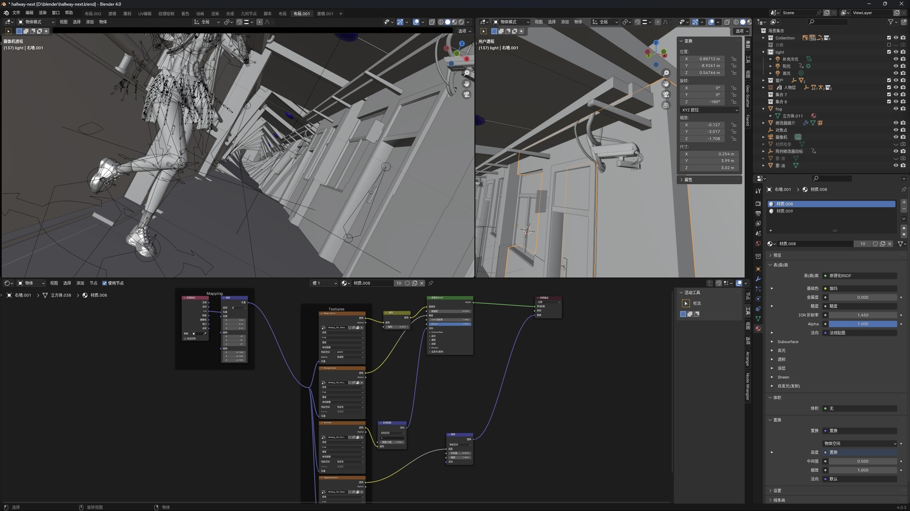

日式校园走廊 · 制作界面

 

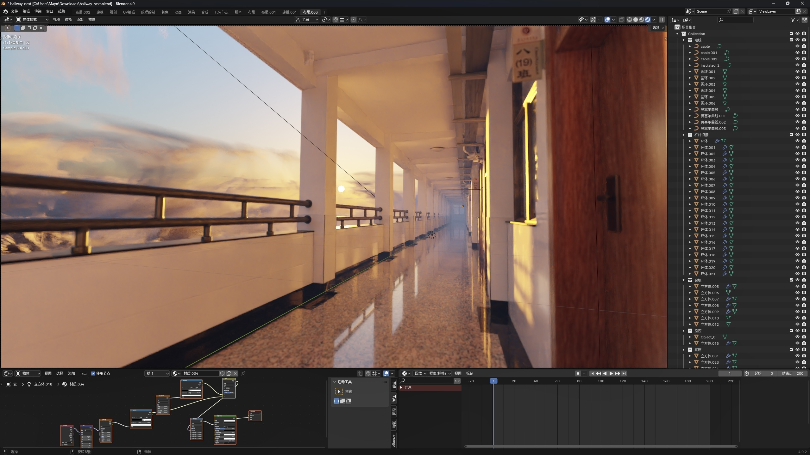

云海校园走廊 · 黄昏 · 制作界面

 

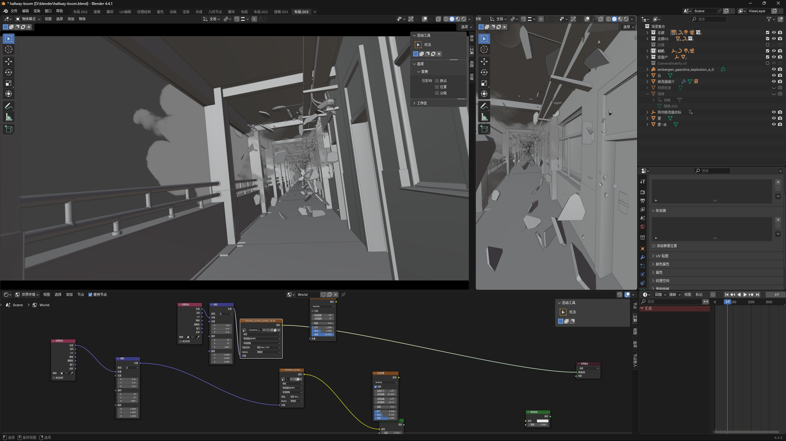

校园走廊 · 爆炸 · 制作界面

 

---

Made with Blender

